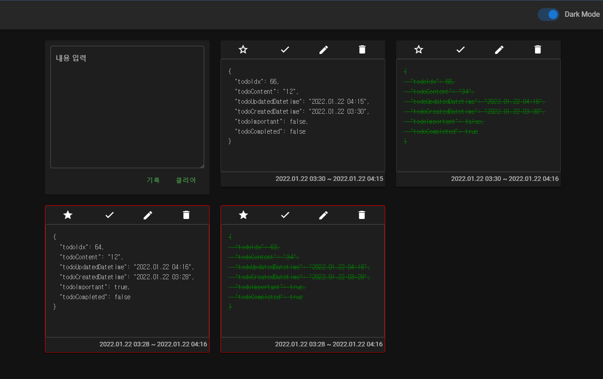

느낀점.
- Spring Boot 공부 많이 필요하다. 기본도 못한다.  
  
# Project_TodoList
Nuxt + Spring Boot

- Nuxt: localhost:3000
> /  
> /todolist    
   
- SpringBoot: localhost:8080
> /lists  
> /post  
> /delete/{todoIdx}  
> /update/{todoIdx}  
   

